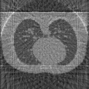
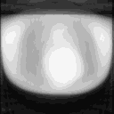
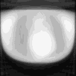
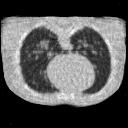

# Sparse View CT Reconstruction Algorithms

This repository contains implementations of several CT (Computed Tomography) reconstruction algorithms, focusing on sparse view CT contexts. Sparse view CT poses an ill-posed inverse problem due to limited projection data, requiring advanced reconstruction techniques to achieve high-quality results. 

## Reconstruction Results

  

    
    
<strong>GT</strong>

  

  

    
    
<strong>FBP</strong>

  

  

    
    
<strong>PLS</strong>

  

  

    
    
<strong>PWLS</strong>

  

  

    
    
<strong>Chambolle-Pock</strong>

  

  

    
    
<strong>ADMM</strong>

  

## Problem Formulation

Sparse view CT reconstruction can be framed as solving the following **inverse problem**:

$$
\mathbf{A} \mathbf{x} = \mathbf{b},
$$

where:
- $\mathbf{A} \in \mathbb{R}^{m \times n}$: Forward projection matrix (describes the CT system geometry).
- $\mathbf{x} \in \mathbb{R}^n$: Image to be reconstructed (unknown variable).
- $\mathbf{b} \in \mathbb{R}^m$: Measured sinogram data (projection data).

Given the limited number of projections ($m \ll n$), the system is underdetermined, making direct inversion ill-posed. Regularization and advanced optimization techniques are necessary to recover $\mathbf{x}$.

---

## Implemented Algorithms

This project implements the following reconstruction methods:

### 1. **Filtered Back Projection (FBP)**

FBP is a classical reconstruction method for CT. It involves:
1. Applying a ramp filter to the measured projections.
2. Back-projecting the filtered data to reconstruct the image.

Mathematically:

$$
\mathbf{x}_{\text{FBP}} = \mathbf{A}^T \mathbf{F} \mathbf{b},
$$

where $\mathbf{F}$ represents the filtering operation in the frequency domain.

---

### 2. **Weighted Least Squares (WLS)**

This method solves the following optimization problem:

$$
\min_{\mathbf{x}} \|\mathbf{A} \mathbf{x} - \mathbf{b}\|_W^2.
$$

where $\mathbf{W}$ represents statistical weights. The solution is obtained by optimising a surrogate of $\|\mathbf{A} \mathbf{x} - \mathbf{b}\|_W^2$.

---

### 3. **Penalized Weighted Least Squares (PWLS) with $L_2$ Total Variation (TV)**

This method incorporates a regularization term to enforce smoothness in the reconstructed image:

$$
\min_{\mathbf{x}} \|\mathbf{A} \mathbf{x} - \mathbf{b}\|_W^2 + \beta \|\mathbf{T} \mathbf{x}\|_2^2,
$$

where:
- $\|\mathbf{T} \mathbf{x}\|_2^2$ is the $L_2$ Total Variation (TV) penalty encouraging smooth gradients.
- $\mathbf{\beta}$ is a regularization parameter controlling the trade-off between data fidelity and regularization.

The solution is obtained by optimising a surrogate of $\|\mathbf{A} \mathbf{x} - \mathbf{b}\|_W^2 + \beta \|\mathbf{T} \mathbf{x}\|_2^2$.

---

### 4. **Chambolle-Pock Algorithm with $L_1$ Total Variation (TV)**

This approach minimizes an $L_1$-regularized objective using the Chambolle-Pock primal-dual algorithm:

$$
\min_{\mathbf{x}} \|\mathbf{A} \mathbf{x} - \mathbf{b}\|_W^2 + \beta \|\mathbf{T} \mathbf{x}\|_1.
$$

The $L_1$ TV penalty encourages sparsity in the gradient domain, preserving edges in the reconstructed image.

#### Optimization:

The Chambolle-Pock algorithm alternates between primal and dual updates:

$$
\mathbf{z}_{k+1} = \text{prox}_{\sigma h^*}(\mathbf{z}_k + \sigma \mathbf{T} \mathbf{x}_k),
$$

$$
\mathbf{x}_{k+1} = \text{prox}_{\tau g}(\mathbf{x}_k - \tau \mathbf{T}^T \mathbf{z}_{k+1}),
$$

$$
\mathbf{\bar{x}}_{k+1} = \mathbf{x}_{k+1} + \theta  (\mathbf{x}_{k+1} - \mathbf{x}_{k}),
$$

where $\text{prox}$ denotes the proximal operator and $\theta$, $\tau$, $\sigma$ are hyperparameters.

---

### 5. **Alternating Direction Method of Multipliers (ADMM) with $L_1$ Total Variation (TV)**

ADMM solves the following constrained optimization problem:

$$
\min_{\mathbf{x}} \|\mathbf{A} \mathbf{x} - \mathbf{b}\|_W^2 + \lambda \|\mathbf{z}\|_1, \quad \text{s.t. } \mathbf{z} = \mathbf{T} \mathbf{x}.
$$

The ADMM framework splits the problem into sub-problems, updating each variable iteratively:

$$
\mathbf{x}_{k+1} = \arg\min_{\mathbf{x}} \|\mathbf{A} \mathbf{x} - \mathbf{b}\|_W^2 + \rho \|\mathbf{z}_k - \mathbf{T} \mathbf{x} + \mathbf{u}_k\|_2^2,
$$

$$
\mathbf{z}_{k+1} = \mathcal{T}(\mathbf{T} \mathbf{x}_{k+1} + \mathbf{u}_k, \frac{\lambda}{\rho}),
$$

$$
\mathbf{u}_{k+1} = \mathbf{u}_k + \mathbf{T} \mathbf{x}_{k+1} - \mathbf{z}_{k+1},
$$

where $\mathcal{T}(a, \tau) = \text{sign}(a) \max(|a| - \tau, 0)$.

